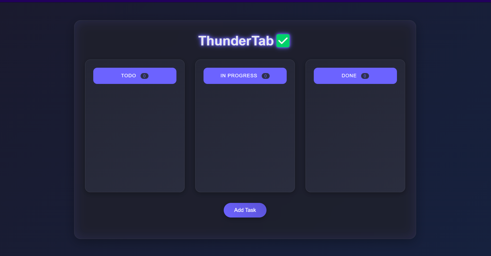

# ThunderTab - Kanban Board Chrome Extension

A simple and intuitive Kanban Board that replaces your new tab page in Chrome. Organize your tasks across Todo, In Progress, and Done boards.

## 🔴 Live Demo

Try the web version here: [ThunderTab Live Demo](https://gaurav0973.github.io/ThunderTab_kanban_extension/)

## 🎥 Demo Video

<details>
<summary>Watch Demo Video 🎬</summary>
<video src="path-to-your-video-file" controls></video>
</details>

## ✨ Features

- ✨ Replaces new tab page with a Kanban board
- 📝 Create and manage tasks easily
- 🔄 Drag and drop tasks between boards
- ⏰ Timestamps for task creation and updates
- 💾 Auto-saves to local storage
- ✏️ Edit tasks with double-click
- 🗑️ Delete tasks with one click

### Chrome Extension
1. **Download the Extension**
   - Clone this repository or download as ZIP
   ```bash
   git clone https://github.com/Gaurav0973/ThunderTab_kanban_extension.git
   ```
   - If downloaded as ZIP, extract it

2. **Load in Chrome**
   - Open Chrome browser
   - Go to `chrome://extensions/`
   - Enable "Developer mode" in the top-right corner
   - Click "Load unpacked"
   - Select the extension folder

3. **Start Using**
   - Open a new tab to see your Kanban board
   - Click "Add Task" to create new tasks
   - Drag tasks between boards
   - Double-click to edit tasks

## Usage

- **Adding Tasks**: Click the "Add Task" button and enter task description
- **Moving Tasks**: Drag and drop tasks between boards
- **Editing Tasks**: Double-click on any task to edit
- **Deleting Tasks**: Click the ❌ button on any task
- **Progress Tracking**: See task counts on each board

## Features

The extension includes:
- Real-time task updates
- Persistent storage
- Drag and drop interface
- Task timestamps
- Task counter for each board

## Local Development

1. Make changes to the code
2. Go to `chrome://extensions/`
3. Click the reload button on the extension
4. Open a new tab to see changes

## Files Structure

```
kanban-board-extension/
│
├── manifest.json        # Extension configuration
├── index.html          # Main interface
├── style.css          # Styling
├── scripts.js         # Core functionality
└── icon.png           # Extension icon
```

## 🎨 Screenshots



## 🛠️ Technologies Used

- HTML5
- CSS3 (with modern animations)
- Vanilla JavaScript
- Chrome Extension API
- Local Storage for data persistence
